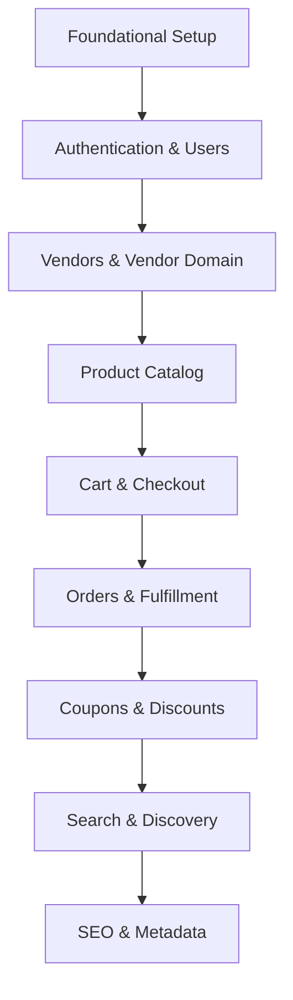

# Implementation Roadmap: vaam-eat-aio

This document details the sequenced, actionable steps for implementing the vaam-eat-aio food delivery platform, based on the completed architecture and schema. Each phase is organized for a dev team to follow, referencing concrete segments, routers, models, and state logic.

---

## Overview

The roadmap follows the modular, schema-driven architecture described in [ARCHITECTURE.md](ARCHITECTURE.md) and [schema.zmodel](schema.zmodel). Phases are grouped to maximize clarity and maintain logical, incremental progress.

---

## Mermaid Diagram: Phase Flow & Domain Relationships

---

## Phase 1: Foundational Setup

- [x] **1.1 Environment & Tooling**
  - Configure linting, formatting (AirBnB, biome), TypeScript strict mode.
  - Set up Tailwind CSS + daisyUI, ensure all utilities/components available.
  - Set up Docker, compose, environment variables, and Vercel deployment config.
  - Configure global error handling (`src/service/error-handler.ts`).

- [x] **1.2 Core Directory & Module Structure**
  - Ensure Next.js app-router segments: `(main)`, `(auth)`, `(vendor)`, `(checkout)`, `(product)`, `api`.
  - Create base folders: `src/app/`, `src/components/`, `src/server/`, `src/hooks/`, `src/trpc/`.
  - Establish naming conventions (kebab-case for files, PascalCase for React components).

- [x] **1.3 Database & Schema**
  - Implement base models in [schema.zmodel](schema.zmodel) for User, Account, Session, Vendor, Product, Cart, Order, Coupon, etc.
  - Set up ZenStack plugins for tRPC, Prisma, and ACLs.
  - Run/verify initial Prisma migrations and ZenStack guards.
  - Integrate PostgreSQL, Redis, S3, SMTP in compose/deployment.
  - Ensure this schema stay up-to-date after changes

---

## Phase 2: Authentication & User Management

- [x] **2.1 Models & Schema**
  - Finalize User, Account, Session models and ACLs in [schema.zmodel](schema.zmodel).
  - Implement related Prisma migrations.

- [x] **2.2 API & Routers**
  - Build tRPC routers for user CRUD, session, and account management in [`src/server/api/routers/user.ts`](src/server/api/routers/user.ts:1).
  - Integrate authentication logic (NextAuth, ZenStack field-level rules).

- [x] **2.3 UI Segments & Components**
  - Implement `(auth)` segment: login, registration, password reset, email validation.
  - Create reusable authentication components (`src/components/auth/`).
  - Add user settings and profile management UI (`src/app/(main)/settings/`, `src/components/settings/`).

- [x] **2.4 State & Validation**
  - Use Formik + Zod for all user forms.
  - Manage user/session state with TanStack Query and Zustand.

---

## Phase 3: Vendors & Vendor Domain

- [x] **3.1 Models & Schema**
  - Define Vendor, VendorMembership, and related models in [schema.zmodel](schema.zmodel).
  - Set up ACLs for vendor/admin access.

- [x] **3.2 API & Routers**
  - Create tRPC routers for vendor CRUD, membership, and profile management in [`src/server/api/routers/vendor.ts`](src/server/api/routers/vendor.ts:1).
  - Build endpoints for vendor onboarding, KYC, and messaging.

- [x] **3.3 UI Segments & Components**
  - Implement `(vendor)` segment: vendor dashboard, profile, product management, order view.
  - Build vendor management components (`src/components/settings/vendor-management-section.tsx`, etc.).

- [ ] **3.4 State & Access Control**
  - Use Zustand for vendor state, TanStack Query for data.
  - Enforce ZenStack ACLs in all vendor operations.

---

## Phase 4: Product Catalog & Categories

- [ ] **4.1 Models & Schema**
  - Create Product, Category, and related models in [schema.zmodel](schema.zmodel).
  - Define relationships: Product ↔ Vendor, Product ↔ Category.

- [ ] **4.2 API & Routers**
  - Develop tRPC routers for product CRUD, category management, product search (`src/server/api/routers/product.ts`).

- [ ] **4.3 UI Segments & Components**
  - Implement `(product)` segment, catalog pages (`src/app/(main)/`, `src/app/(product)/`).
  - Build product listing, detail, and category grid components (`src/components/home/home-categories.tsx`, `src/components/home/category-grid.tsx`, etc.).

- [ ] **4.4 State & Caching**
  - Use TanStack Query for product/category data fetching, Redis for caching.
  - Implement optimistic UI for product actions via tRPC mutation options.

---

## Phase 5: Cart & Checkout

- [ ] **5.1 Models & Schema**
  - Finalize Cart, CartItem models in [schema.zmodel](schema.zmodel).
  - Ensure proper relations with User and Product.

- [ ] **5.2 API & Routers**
  - Build tRPC routers for cart CRUD, checkout, and validation logic.

- [ ] **5.3 UI Segments & Components**
  - Implement `(checkout)` and cart segments (`src/app/(checkout)/`, `src/app/(main)/cart/`).
  - Build cart display, add/remove/update item components (`src/components/cart/`).

- [ ] **5.4 State & Validation**
  - Manage cart state with Zustand and TanStack Query.
  - Validate checkout with Formik + Zod.

---

## Phase 6: Orders & Fulfillment

- [ ] **6.1 Models & Schema**
  - Implement Order, OrderItem, Fulfillment models and status enums.

- [ ] **6.2 API & Routers**
  - Create tRPC routers for order placement, status updates, fulfillment tracking.

- [ ] **6.3 UI Segments & Components**
  - Build orders pages for users and vendors (`src/app/(main)/orders/`, `src/app/(vendor)/vendors/[vendorId]/orders/`).
  - Implement order detail, order list, and fulfillment status components (`src/components/orders/`).

- [ ] **6.4 State & Optimistic UI**
  - Use TanStack Query for order state, optimistic updates for order status.

---

## Phase 7: Coupons & Discounts

- [ ] **7.1 Models & Schema**
  - Define Coupon, Discount models and relations.

- [ ] **7.2 API & Routers**
  - Implement tRPC routers for coupon management and validation.

- [ ] **7.3 UI Segments & Components**
  - Add coupon entry, validation, and display in cart/checkout UIs.

- [ ] **7.4 State & Validation**
  - Integrate coupon state with cart and checkout flows.

---

## Phase 8: Search & Discovery

- [ ] **8.1 API & Routers**
  - Implement product/vendor search endpoints (full-text, filters).

- [ ] **8.2 UI Segments & Components**
  - Build search page and components (`src/app/(main)/search/`, `src/components/search/`).

- [ ] **8.3 State & Caching**
  - Use TanStack Query for search results, Redis for result caching.

---

## Phase 9: SEO & Metadata

- [ ] **9.1 Dynamic Metadata**
  - Ensure all pages and products generate dynamic SEO metadata (title, description, OpenGraph, etc.).
  - Implement sitemap and robots.txt endpoints (`src/app/api/sitemaps/`).

- [ ] **9.2 Structured Data**
  - Add structured data (JSON-LD) to product and vendor pages for rich search results.

---

## General Cross-Cutting Concerns

- [ ] **Error Handling:** Use `showErrorToast` in all user-facing error scenarios.
- [ ] **Testing:** Write unit tests for routers (Vitest + SQLite), component tests with Testing Library/MSW.
- [ ] **Access Control:** Use ZenStack for all field-level and role-based access.
- [ ] **Performance:** Use Redis caching, optimize DB queries, lazy-load components.
- [ ] **DevOps:** Harden Docker images, tune orchestration, ensure HA and security best practices.