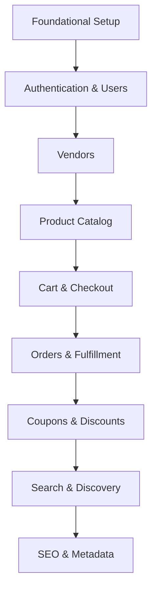

# Implementation Roadmap: **vaam‑eat‑aio**

This roadmap breaks the platform build into clear, sequenced phases that match **ARCHITECTURE.md**. Every phase and sub‑phase has a one‑line description, and each task under it is atomic with its own one‑liner.

---

## Overview

Follow the schema‑driven, domain‑modular approach from `ARCHITECTURE.md` and `prisma/schema.zmodel`, moving top‑down to avoid context switches.

---

## **State Management Strategy** _(tRPC + TanStack Query + Zustand + localforage)_

> **Purpose:** Define clear boundaries between _server‑state_ and _client‑only_ state so that data is never duplicated and UX remains snappy—even offline.

| Concern                                                                   | Primary Tool                                             | Implementation Notes                                                                                                                                                                                                       |
| ------------------------------------------------------------------------- | -------------------------------------------------------- | -------------------------------------------------------------------------------------------------------------------------------------------------------------------------------------------------------------------------- |
| **Server / remote data** (CRUD, caching, optimistic updates, realtime)    | **tRPC auto‑generated by ZenStack** + **TanStack Query** | Generated procedures are wrapped in `@trpc/react-query` hooks **under the `trpc.zen.<entity>` namespace** (e.g., `trpc.zen.product.list.useQuery`). No data from these hooks should ever be mirrored into any other store. |
| **Client‑only / ephemeral state** (cart, UI flags, filters, map viewport) | **Zustand** _(persisted via `localforage`)_              | One global store with domain‑specific slices. Persistence handled via `persist` middleware + `createJSONStorage(() => localForage)`.                                                                                       |

### Core Rules

1. **Single Source of Truth**
   - Remote data lives **only** in generated tRPC via TanStack Query’s cache.
   - UI/session data lives **only** in Zustand.
2. **Query Keys Driven by Store Values**
   Use Zustand selectors directly inside `trpc.zen.*.useQuery([...key])` so cache invalidation remains automatic.
3. **Invalidate, Don’t Copy**
   On every successful mutation, call `queryClient.invalidateQueries([...])` or use the ZenStack‑generated invalidation helpers instead of updating Zustand manually.
4. **Persistence Layer**
   Cart and other long‑lived client state is persisted to IndexedDB via `localforage` to survive hard refreshes and PWAs.
5. **Provider Order**
   Done in `@app/trpc/react.tsx` and imported in `src/app/layout.tsx`

---

## Mermaid Diagram – Phase Flow & Domain Dependencies

---

## Phase 1 · Foundational Setup _(✓ completed)_

_Set up the core environment, toolchain, and initial schema baseline._

### 1.1 Environment & Tooling
_Bootstrap linting, formatting, styling, containerization, and deployment tooling._

- [x] **ESLint + Prettier + TS strict** — lock in linting, formatting, and strict typing across the codebase.
- [x] **Tailwind CSS + daisyUI install** — set up utility‑first styling with themed components.
- [x] **`@app` alias configured** — simplify deep imports via `tsconfig.json` and eslint resolver.
- [x] **Multi‑stage Docker & Compose** — define containers for web, Postgres, Redis, MinIO, and Mailpit.
- [x] **VEnv vars** — enable CI/CD and preview deploys on PRs.
- [x] **Global `showErrorToast` util** — standardise user‑facing error handling via `@app/utils/error-handler.ts`.
- [ ] **Install Zustand + localforage** — add `zustand`, `zustand/middleware`, and `localforage` deps; set up example persisted store.

### 1.2 Core Directory Skeleton
_Define base folders and naming rules to enforce code organization._

- [x] **Scaffold App Router segments** — create `(auth)`, `(vendor)`, `(checkout)`, `(product)`, `(main)`, and `api` groups.
- [x] **Create base folders** — initialize `src/components`, `src/hooks`, `src/server`, `src/trpc`, and `prisma`.
- [ ] **Enforce naming conventions** — use PascalCase for component and kebab-case for helpers and routes.

### 1.3 Database & Schema
_Establish initial data models, migrations, seeds, and local dependencies._

- [x] **Define ZModel entities** — User, Account, Session, Vendor, Product, Cart, Order, and Coupon schemas.
- [x] **Install ZenStack plugins** — generate ACL, Prisma, and tRPC integration.
- [x] **Run initial `prisma migrate` & commit** — apply migrations and version SQL in Git.
- [x] **Seed local database** — add sample data for rapid UI development.
- [x] **Compose services** — spin up Postgres, Redis, MinIO, and Mailpit via `docker-compose.yml`.

---

## Phase 2 · Authentication & Users _(✓ completed)_

_Build user auth flows, schemas, routers, and UI._

### 2.1 Models & ACLs
_Define auth data models and enforce access controls._

- [x] **Finalize User/Account/Session schemas** — solidify authentication structures in ZModel.
- [x] **Write ZenStack ACL rules** — restrict personal data to respective users.

### 2.2 API Routers
_Create secure, type‑safe endpoints for auth operations._

- [x] **Implement NextAuth handler** — support OAuth/email login with JWT in `src/app/api/auth/[...nextauth]/route.ts`.

### 2.3 UI
_Deliver authentication and profile management interfaces._

- [x] **Build auth pages** — login, register, reset password, and verify email screens.
- [x] **Develop profile & settings pages** — allow users to view and update account info.

### 2.4 State & Validation
_Integrate form handling and client‑side caching._

- [x] **Integrate Formik + Zod** — client‑side form handling and schema validation.
- [x] **Use generated tRPC** — cache and manage user and session state reactively.

---

## Phase 3 · Vendors

_Enable vendor onboarding, management, and dashboard capabilities._

### 3.1 Models & ACLs _(✓)_
_Model vendor entities and permissions._

- [x] **Add Vendor & VendorMembership schemas** — represent merchant accounts and roles.
- [x] **Author ZenStack ACL for vendors** — enforce admin‑only access to vendor resources.

### 3.2 UI _(✓)_
_Provide vendor dashboard and component library._

- [ ] **Implement vendor dashboard UI** — product management, orders view, and analytics.
- [x] **Build vendor component library** — reusable elements in `src/components/vendor/`.

### 3.3 State & Access Control
_Manage client cache and test ACL enforcement._

- [ ] **Cache vendor data with generated tRPC** — offline‑first UX for vendor pages.
- [ ] **Write ACL integration tests** — validate ZenStack rules on all vendor procedures.

---

## Phase 4 · Product Catalog

_Construct product and category schemas, endpoints, and UI._

### 4.1 Models & Schema
_Define catalog entities and relationships._

- [x] **Define Product, Category & Tag models** — schema relations and indexes in ZModel.
- [x] **Set up foreign keys** — Vendor↔Product and Product↔Category in Prisma.

### 4.2 UI
_Develop catalog browsing and landing interfaces._

- [ ] **Build catalog pages** — grid views, filters, and product details.
- [x] **Home category section** — featured categories on the landing page.

### 4.3 State & Caching
_Implement client caching and server‑side acceleration._

- [ ] **Use generated tRPC** — infinite scroll, pagination, and for product data.

---

## Phase 5 · Cart & Checkout

_Implement shopping cart flows, checkout logic, and UI._

### 5.1 Models
_Define shopping basket schemas and relations._

- [x] **Add Cart & CartItem schemas** — basket structure and attributes.
- [x] **Link User↔Cart & Cart↔Product** — enforce ownership and stock references.

### 5.2 UI
_Create interactive cart and checkout UIs._

- [ ] **Create cart UI** — drawer, listing, and item controls in `src/components/cart/`.
- [ ] **Build checkout flow** — address form, payment step, and order confirmation.

### 5.3 State & Validation
_Manage reactive cart state and form validation._

- [ ] **Persist cart with Zustand + localforage** — offline cart retrieval and multi‑tab sync.
- [ ] **Sync cart with generated tRPC** — query invalidate on checkout and stock updates.
- [ ] **Use Formik + Zod** — validate address and payment forms client‑side.

---

## Phase 6 · Orders & Fulfillment

_Build order placement, tracking, and vendor fulfillment flows._

### 6.1 Models
_Specify order schemas and status lifecycle._

- [x] **Define Order, OrderItem & Fulfillment models** — capture line items and shipments.
- [x] **Add status enums** — PENDING, CONFIRMED, IN_TRANSIT, DELIVERED, CANCELED.

### 6.2 UI
_Design order views for users and vendors._

- [ ] **Build user orders pages** — list past and active orders.
- [ ] **Vendor order management** — vendor‑side lists and detail views.

### 6.3 State & Optimistic UI
_Enable responsive status updates._

- [ ] **Use TanStack Query** — subscribe/poll for updates and cache state.
- [ ] **Enable optimistic updates** — immediate feedback on status changes.
- [ ] **Use zustand** — persist user's orders and vendors (immutable).

---

## Phase 7 · Coupons & Discounts

_Add promotional code support to cart and checkout._

### 7.1 Models
_Model promo code entities and rules._

- [ ] **Define Coupon & DiscountRule schemas** — represent promo and conditional logic.

### 7.2 UI
_Provide coupon input and feedback._

- [ ] **Add coupon UI** — input fields and validation messages in cart/checkout.

### 7.3 State & Validation
_Integrate coupon logic into cart pricing._

- [ ] **Recalculate totals on apply** — update cart state with discounts via TanStack Query.
- [ ] **Use zustand** — persist user's coupons.

---

## Phase 8 · Search & Discovery

_Implement search capabilities for products and vendors._

### 8.1 UI
_Design search interface and result layouts._

- [ ] **Use MapLibre page** — map-first inputs.
- [ ] **Search page in modal** — on top of the map, filters, and result grid.

### 8.2 State & Caching
_Optimize client UX and server caching._

- [ ] **Use TanStack Query** — debounce, cache, and infinite scroll.
- [ ] **Use protomaps** — download maps, offline use, conditional – depends on the user.

---

## Phase 9 · SEO & Metadata

_Ensure SEO best practices and structured data are in place._

### 9.1 Dynamic Metadata
_Generate page meta and social tags._

- [ ] **Generate metadata** — titles, descriptions, and OpenGraph via `generateMetadata`.
- [ ] **Implement sitemap route** — dynamic `sitemap.xml` in `src/app/api/sitemaps/route.ts`.

### 9.2 Structured Data
_Add rich result markup for search engines._

- [ ] **Add JSON‑LD** — embed product and vendor schemas for SERP enhancements.

---

## Cross‑Cutting Obligations (continuous)

_Apply quality, performance, and security standards across all phases._

| Area            | Checklist                                                                                            |
| --------------- | ---------------------------------------------------------------------------------------------------- |
| **Error UX**    | Always call `showErrorToast` for any user‑facing error flows.                                        |
| **Testing**     | Unit → **vitest** + in‑memory SQLite; Component → Testing‑Library + MSW; e2e → Playwright later.     |
| **Access**      | Enforce ZenStack ACLs on all tRPC procedures at field‑ and role‑level.                               |
| **Performance** | Leverage Redis caching, `revalidatePath()`, lazy loading, and weekly bundle analysis.                |
| **State**       | Follow the **State Management Strategy** table—no cross‑duplication, cart persisted via localforage. |
| **DevOps**      | Harden Docker images, scan CVEs, enforce 90%+ test coverage, blue‑green deploy, multi‑region HA.     |

---
